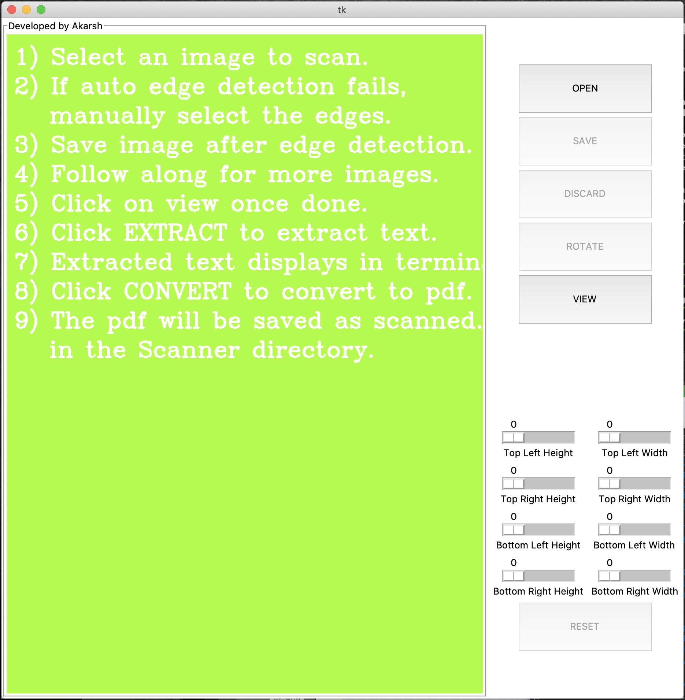
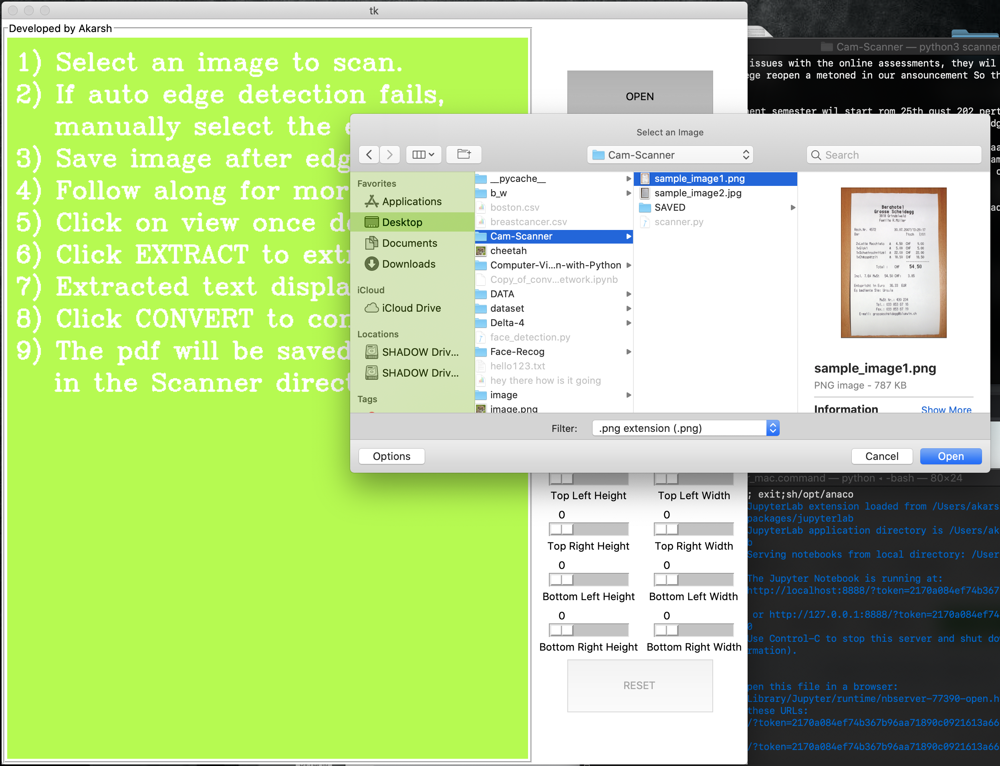
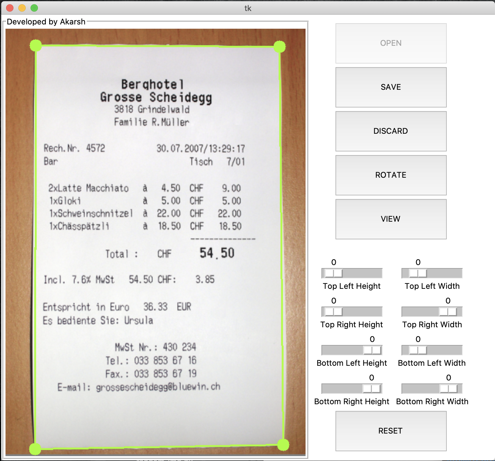
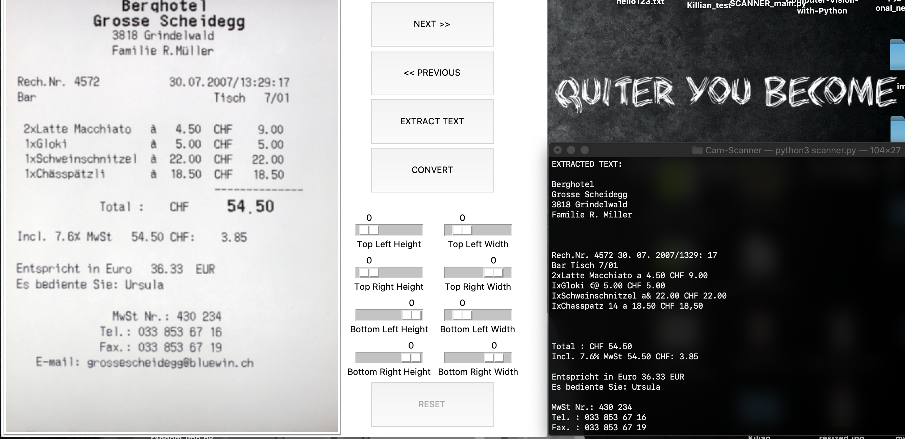
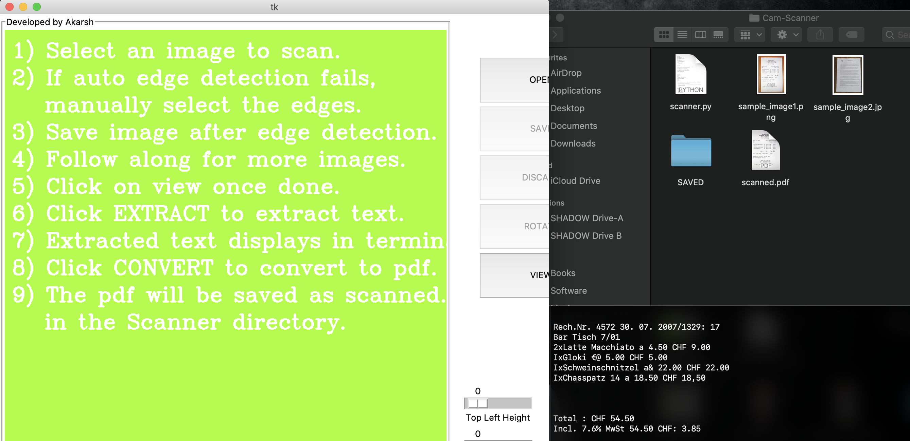
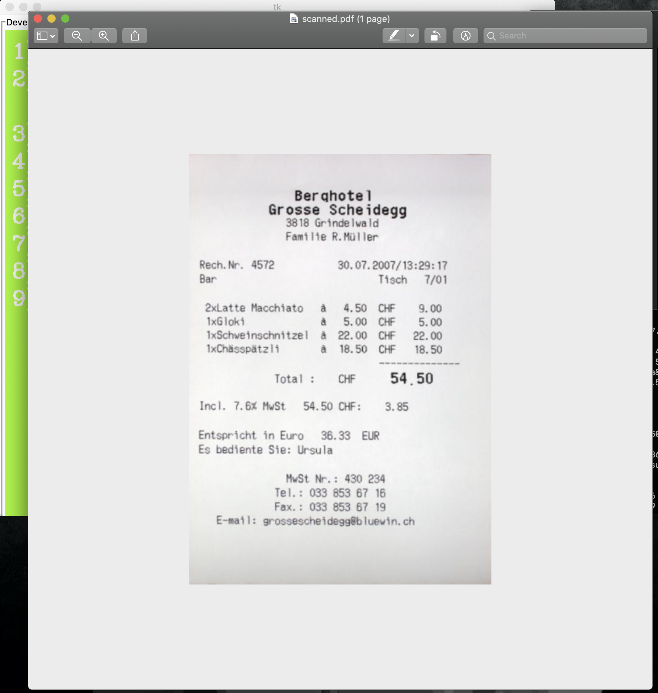

# Scanner
Developed using OpenCV to automatically detect edges of an A4 sheet and convert it into pdf document.
## Required Modules:
  1) cv2
  2) PIL (pillow)
  3) numpy
  4) imutils
  5) shutil
  6) tesseract-ocr (Specific to Ubuntu and Mac)
  
 1) To run the script open terminal and redirect to the Cam-Scanner directory and type :"python3 scanner.py"
 
 
 2) Now click on OPEN button and select the image you want to scan.
 
 
 3) Click on SAVE button once the required changes are made:
 
 
 4) Click on VIEW button and to extract text, click on EXTRACT TEXT button (THe extracted text will be displayed on the terminal:
 
 
 5) Click on CONVERT button to convert the images to pdf. The pds will be saved as scanned.pdf in the "Cam-Scanner" directory:
 
 
 6) The scanned pdf would look similar to:
 
 
 
